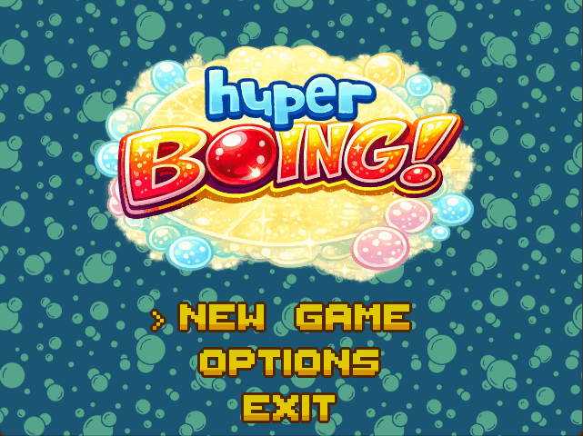

# Hyper Boing

## 🎮 About

**Hyper Boing** is a Super Pang-inspired arcade game originally developed in **2001** as a university computer graphics class project by **Miguel Martinez Rodilla**. The game was initially built using DirectX and has been recently modernized and ported to **SDL 2** in **2025**, bringing this classic project back to life with cross-platform compatibility.

## 🛠️ Building the Project

### Prerequisites

To compile Hyper Boing, you need to set up the following **environment variables** for SDL 2:

1. **`SDL_ROOT`** - Path to your SDL2 installation directory  
   Example: `C:\Libraries\SDL2-2.28.0`

2. **`SDL_IMAGE_ROOT`** - Path to your SDL2_image installation directory  
   Example: `C:\Libraries\SDL2_image-2.6.3`

3. **`SDL_MIXER_ROOT`** - Path to your SDL2_mixer installation directory  
   Example: `C:\Libraries\SDL2_mixer-2.6.3`

4. **`SDL_TTF_ROOT`** - Path to your SDL2_ttf installation directory  
   Example: `C:\Libraries\SDL2_ttf-2.20.2`

### Compilation

Once the environment variables are set, open the solution in Visual Studio and build the project.

## 🎯 How to Play

### Default Controls

#### Player 1
- **Arrow Left** - Move left
- **Arrow Right** - Move right
- **Space** - Shoot

#### Player 2 (if enabled)
- **A** - Move left
- **D** - Move right
- **Left Ctrl** - Shoot

### Debug Features

- **F1** - Toggle debug console
- **Backtick (`)** or **F9** - Open AppConsole
- Type `/help` in the console to see available commands

### Game Objective

Pop all the bouncing balls by shooting your harpoon! Each ball splits into smaller balls when hit, until they're finally destroyed. Avoid touching the balls or you'll lose a life. Complete each stage before time runs out!

## 📋 Version History

### Version 0.4 – (WIP)
- Refactored global variables to singleton pattern
- Implemented resource preloading for faster screen transitions
- Added `Logger` class with configurable log levels
- Introduced `AppConsole` with command prompt and log viewer
- Added console commands: `/help`, `/echo`, `/clear`, `/level`, `/next`
- Migrated to smart pointers (`unique_ptr`) for improved memory management
- Added Makefile, and fixed paths to compile under Linux
- Replaced MList class by a std::list

### Version 0.3 – January 2025
- Added support for standard `.fnt` bitmap fonts
- Full English localization
- Redesigned logo and main menu
- Replaced settings dialog with in-game settings screen
- Standardized file formats and class naming conventions
- Implemented persistent settings configuration
- Rebranded project as "Hyper Boing"
- Replaced placeholder backgrounds with custom artwork
- Migrated from MIDI to OGG audio format
- Integrated `AudioManager` with SDL_mixer for OGG playback
- Replaced all audio with royalty-free music

### Version 0.2 – June 2024
- Initial SDL 2 port
- Removed legacy MFC dialogs
- Converted BMP assets to transparent PNG format

### Version 0.1 – June 2001
- Original DirectX implementation
- Windows-only version
- University computer graphics project

## 🏁 Roadmap

### Architecture & Memory Management
- [x] Complete migration to smart pointers for dynamic allocations
- [ ] Implement deferred garbage collection system with dirty flag pattern for game objects
- [ ] Add comprehensive Doxygen documentation.

### Physics & Collision Detection
- [ ] Refactor collision detection to combine AABB (axis-aligned bounding box) with circle collisions
- [ ] Implement composite collision shapes (e.g., player as circle + rectangle compound)
- [ ] Optimize collision detection with spatial partitioning

### Event System & Game Logic
- [ ] Design and implement event bus with pub-sub pattern for entity interactions
- [ ] Refactor hardcoded behaviors into data-driven `Action` system
- [ ] Create `Motion` class for parameterized animations (position, duration, easing functions)
- [ ] Implement `MotionSequence` for chaining animation primitives

### Audio & Effects
- [ ] Integrate sound effects broadly across game events (shooting, ball hits, power-ups)

### Gameplay Features
- [ ] Add secondary weapon system (gun)
- [ ] Implement power up items for weapon pickups
- [ ] Add a power-up system with temporary buffs (speed, invincibility)

### Content Pipeline
- [ ] Migrate stage/level definitions to file data in plain text (JSON or ini format)
- [ ] Develop in-game level editor with serialization support

### Testing & Quality Assurance
- [ ] Integrate lightweight unit testing framework (Catch2 or doctest)
- [ ] Write unit tests for core systems (collision, motion, events)
- [ ] Establish CI pipeline for automated builds and tests

## 📜 License

This project is licensed under the **MIT License** - feel free to use, modify, and distribute it as you see fit.

## 🎨 Features

- Classic arcade-style gameplay
- Multiple stages with increasing difficulty
- 1-2 player support
- Power-ups and special items ( TODO )
- Score tracking
- Debug console with real-time game state inspection
- Smooth SDL 2 rendering
- Custom bitmap font system (`.fnt` format) for retro-styled text rendering

## 🔧 Technical Details

- **Language**: C++14
- **Graphics**: SDL 2
- **Audio**: SDL_mixer
- **Image Loading**: SDL_image
- **Text Rendering**: Custom bitmap fonts (`.fnt` files)
- **Original API**: DirectX (2001)
- **Modern Port**: SDL 2 (2024)

## 🙏 Acknowledgments

Special thanks to the original Super Pang arcade game that inspired this project, and to the SDL community for providing excellent cross-platform libraries that made this port possible.

---

**Enjoy playing Hyper Boing!** 🎈💥
